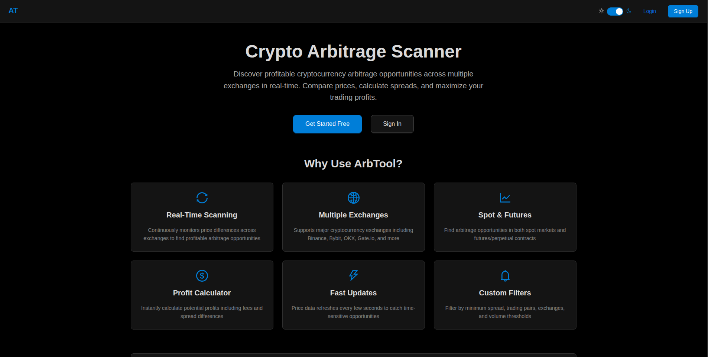
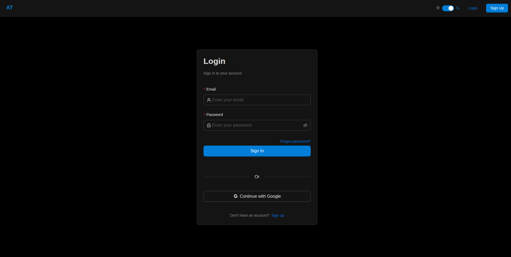
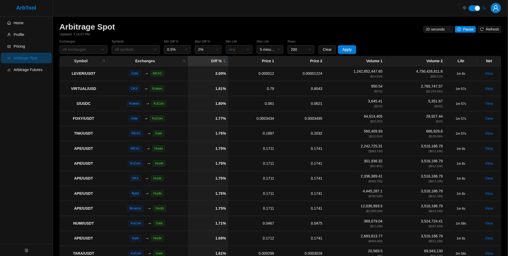
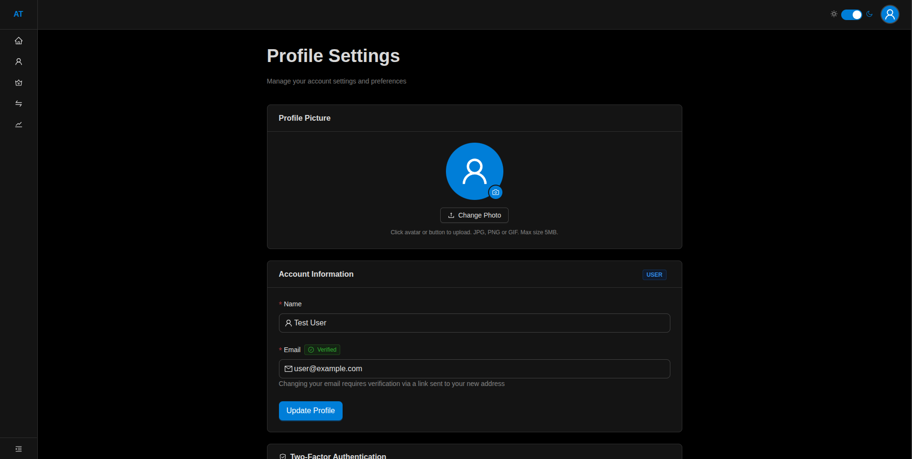
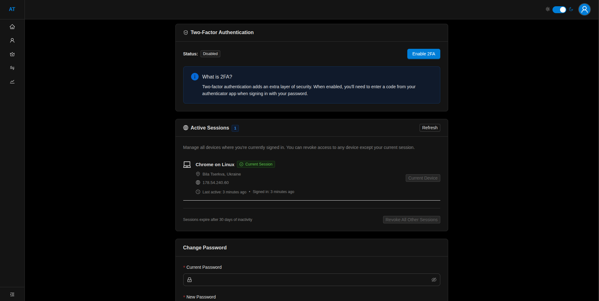
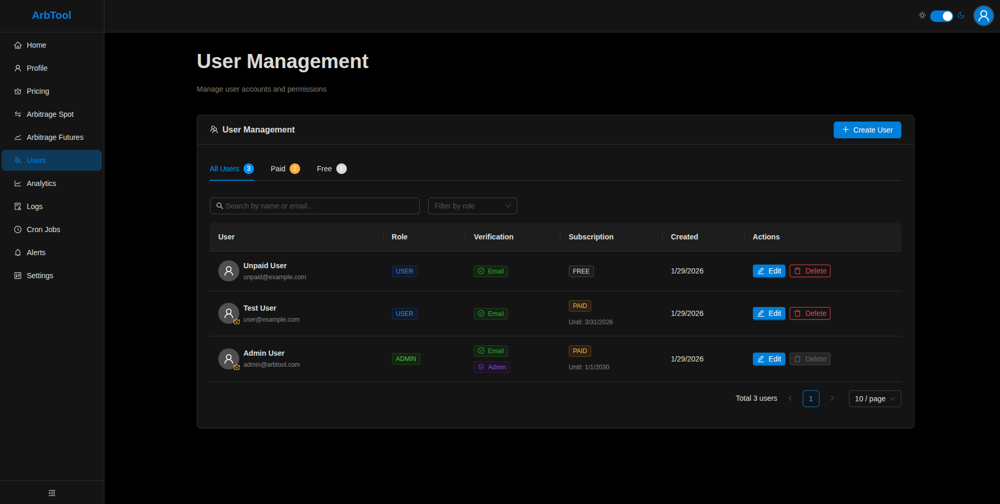
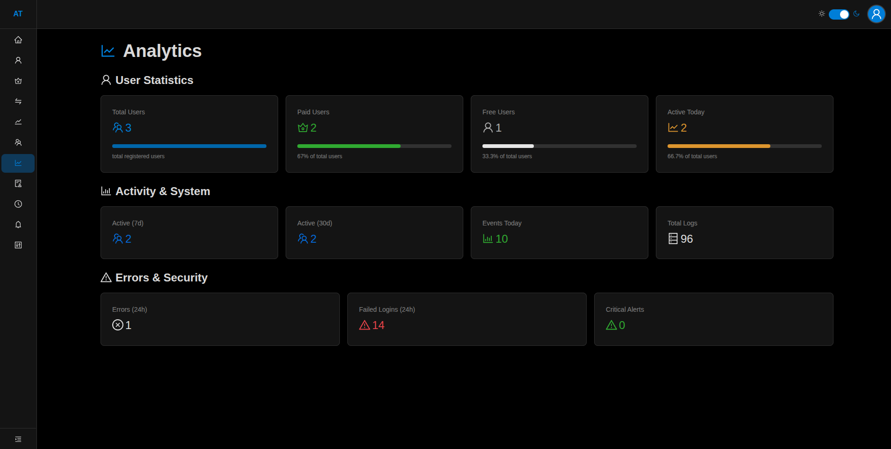
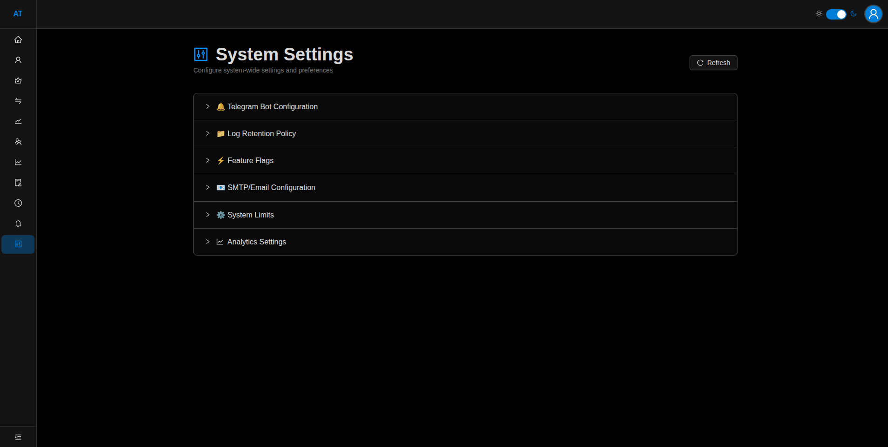

# ArbTool - Crypto Arbitrage Scanner

Real-time cryptocurrency arbitrage scanner that monitors price differences across multiple exchanges (Binance, Bybit, OKX, Gate.io, etc.) to help traders find profitable opportunities in spot and futures markets.

**Live Demo:** [arbtool.agcorpint.com](https://arbtool.agcorpint.com/)

## Tech Stack
- **Frontend:** Next.js 15, React, Ant Design
- **Backend:** Next.js API Routes, Prisma ORM
- **Database:** PostgreSQL
- **Auth:** Auth.js (Google OAuth + Credentials)
- **Deployment:** Docker, Nginx

## Screenshots

| | | |
|:---:|:---:|:---:|
|  |  |  |
|  |  |  |
|  |  |  |

## Demo Accounts

Test paid user:
user@example.com
user123

Test unpaid user:
unpaid@example.com
user123
